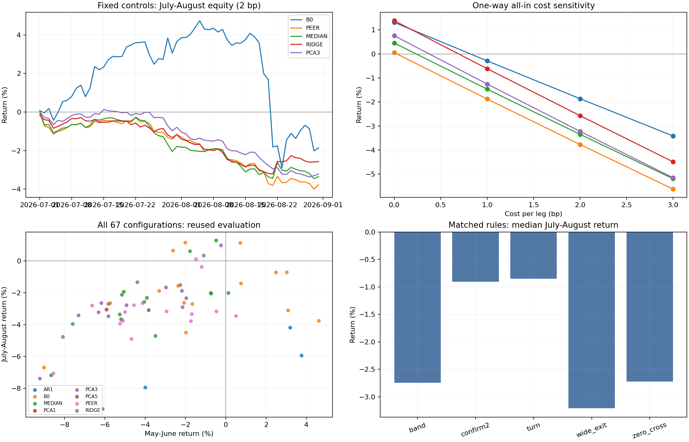

# v3 多定价公式、周期与开平仓逻辑研究

## 主要发现

完成 67 个唯一配置、8 类信号模型的扩展回测，以及 10 个代表配置的 0—3 bp 成本敏感性。2 bp 下，7—8 月有 8 个配置为正；同时在 5—6 月与 7—8 月为正的只有 B0 60 分钟反转确认规则（+0.72%、+1.15%），它是单标的基线。多标的模型在这两个阶段没有同时为正的配置。验证期排名前五的配置在后一阶段全部亏损，当前矩阵没有给出稳定的多标的均值回归优势。

**本轮是复用历史样本的回顾性探索。** 7—8 月已在 v2 和本轮调试中被查看，不能称为未见过的最终检验。结果文件中的 holdout 只是兼容旧代码的时期标签。67 个配置在最终运行前固定，排名程序只使用 5—6 月，但这不消除此前查看数据及多重比较的影响；独立确认需要新的未使用样本。

## 同一基准下比较合理价

下表固定 15 分钟信号、4 小时中心、7 天尺度、2σ 入场和 0.5σ 平仓；最大持仓 4 小时。收益为账户权益变化，包含所有对冲腿、手续费和资金费。最后一列是交易价格损益/双边换手折算的单边盈亏平衡 bp，不含资金费，且不等于能够实际获得的交易费率。

| 模型 | 5—6 月 | 7—8 月 | 后期交易数 | 后期价格盈亏平衡 bp |
|---|---|---|---|---|
| B0 | -3.32% | -1.86% | 795 | 0.78 |
| PEER | -5.10% | -3.77% | 973 | 0.02 |
| MEDIAN | -5.27% | -3.35% | 963 | 0.22 |
| RIDGE | -4.04% | -2.57% | 993 | 0.67 |
| PCA3 | -6.31% | -3.22% | 1006 | 0.36 |

以下为这些固定控制在 7—8 月的成本曲线。0—3 bp 是每一条成交腿的单边综合成本假设；没有另外模拟盘口冲击、排队或 maker 返佣。资金费单独进入现金账本。

| 模型 | 0 bp | 1 bp | 2 bp | 3 bp |
|---|---|---|---|---|
| B0 | 1.31% | -0.29% | -1.86% | -3.41% |
| PEER | 0.05% | -1.87% | -3.77% | -5.62% |
| MEDIAN | 0.45% | -1.47% | -3.35% | -5.19% |
| RIDGE | 1.38% | -0.61% | -2.57% | -4.49% |
| PCA3 | 0.75% | -1.25% | -3.22% | -5.15% |

## 定价公式和更新时点

记 y=log(P)，r 为完成柱的对数收益。共同原则是：先得到价格或残差序列 x，再用此前数据构造中枢 q 和偏离 u；每个历史残差自身也使用当时可知的中枢。

    q[i,t] = center(x[i,t-1], ..., x[i,t-Nc])
    u[i,t] = x[i,t] - q[i,t]
    z[i,t] = u[i,t] / std(u[i,t-1], ..., u[i,t-Ns])

标准差为样本标准差；中心和尺度至少积累各自一半窗口后才能使用。EWMA 对照使用 span=Nc、adjust=False，并不是半衰期等于 Nc。

| 模型 | x 的定义 / 收益定价公式 | 执行 |
|---|---|---|
| B0 | x=y；合理价 exp(q) | 单标的反向仓位 |
| PEER | x[i]=y[i]-mean(y[j], j≠i)；合理价 exp(peer_log_price+q[i]) | 目标和其他 19 币等权篮子 |
| MEDIAN | e[i]=r[i]-median(r[j], j≠i)；x[i]=累计 e[i]；隐含合理价 exp(y[i]-x[i]+q[i]) | 等权 peer 篮子近似执行 |
| Ridge | r_hat[i]=alpha[i]+beta[i]·r[其他19币]；x 为累计 r-r_hat | 回归系数篮子 |
| PCA1/3/5 | 其他19币标准化收益投影到 k 个主成分 F；r_hat[i]=mu[i]+sd[i]·F·beta[i]；x 为累计残差 | 因子回归系数篮子 |
| AR1 | 用过去7天估计均值 mu 与 rho；f[t]=mu+rho^h·(y[t-1]-mu)，x[t]=y[t]-f[t]，h 对应4小时；最终中心为 f[t]+q[t] | 单标的探索控制 |

Ridge 在标准化收益上使用固定惩罚 100，包含截距 alpha=mean(target)-mean(peers)·beta。PCA 使用固定微小正则 1e-6；回归与因子均按 UTC 日、以前 28 天同频收益重新估计，当天参数冻结，每个目标排除自身。AR1 逐柱滚动，rho 截断到 [0,0.995]，没有证明残差为平稳 OU 过程。

MEDIAN 使用收益而不是名义币价中位数，因而各币价格单位改变不会改变信号。它的非线性定价残差仍不能被固定等权篮子精确复制。PCA/Ridge 建仓前的美元中性投影也会改变原始回归对冲比例，美元中性不等于所有因子中性；持仓数量入场后冻结，退出信号仍更新。以上都是模型解释的边界，不能把残差收敛直接当作已实现组合利润。

这些模型使用同一已完成时刻其他标的的信息估算相对中枢，并未证明对未来目标价格有可靠预测能力。

## 周期与开平仓实验

矩阵包含 5/15/60 分钟信号；15 分钟下额外比较（1 小时中心、1 天尺度）、（4 小时、7 天）、（12 小时、14 天）。中心和尺度成对改变，因此这个对照不能单独归因于其中一个窗口。SMA、EWMA、中位数中心在固定模型上比较；PCA1/PCA5 为固定因子数对照。没有把所有参数做笛卡尔积，也没有优化币种子集。

所有交易规则固定 |z|≥2 入场、最长4小时、组合价格损失达到实际建仓总名义3%时止损；止损只在信号柱检查，延迟成交可能使实际损失超过3%。退出是浮动中枢。比较五种规则：

- band：|z|≤0.5 平仓；若一根柱跳过该带，不会自动触发这项条件。
- wide_exit：|z|≤1 平仓。
- confirm2：连续两柱同方向超过2σ才开，随后按 band 平仓。
- turn：仍在2σ外，但偏离相较上一柱开始缩小时开，随后按 band 平仓。
- zero_cross：入场后偏离首次穿过零点平仓，即使跳过零附近也退出。

以下只比较同样四个模型（B0/PEER/MEDIAN/PCA3）、同样15/60分钟、同样4小时/7天窗口，每条规则8个配置，避免基线组样本更多造成不公平比较：

| 规则 | 配置数 | 5—6 月中位收益 | 7—8 月中位收益 |
|---|---|---|---|
| band | 8 | -2.64% | -2.74% |
| confirm2 | 8 | -2.00% | -0.91% |
| turn | 8 | -1.79% | -0.85% |
| wide_exit | 8 | -2.11% | -3.21% |
| zero_cross | 8 | -0.81% | -2.72% |

验证期前五名只按 5—6 月2 bp收益且交易数≥30选出；选择不依赖后期收益。其失效情况如下。成本表 selection_rank=1—5 是固定对照，6—10 是这五个领先配置，不是总体收益排名。

| 模型 | 信号分钟 | 中心小时 | 中枢形式 | 逻辑 | 5—6 月 | 7—8 月 |
|---|---|---|---|---|---|---|
| B0 | 15 | 4 | median | median | 4.60% | -3.75% |
| AR1 | 15 | 12 | sma | band | 3.75% | -5.94% |
| AR1 | 60 | 4 | sma | band | 3.19% | -4.18% |
| B0 | 60 | 4 | sma | wide_exit | 3.08% | -3.09% |
| B0 | 60 | 4 | sma | zero_cross | 3.03% | -0.71% |

## 样本、执行与不确定性

使用最终20币的现有本地 Parquet：UTC [2026-03-01,2026-09-01)，每币264,960分钟，共5,299,200行；未重新下载K线。正式池使用FIL替代旧TON，选择完整六个月的池仍有存活样本偏差。20币资金费数据各552条来自本地API缓存。4个零成交分钟（LTC1、DOT1、HBAR2）所在聚合柱仍可能保留，因为当前只要求整柱总量>0；没有声称已执行严格逐分钟成交过滤敏感性。

3—4月用于暖启动和形成，5—6月排序，7—8月回顾性评估。模型系数可滚动使用当时已经发生的数据。5月1日和7月1日前一分钟强平；关仓费计入前一阶段，下一阶段以同一现金为基准。

精确成交时刻：5分钟柱 [00:00,00:05) 的最终分钟标签为00:04，代码在该标签加2分钟，即00:06开盘成交；相当于柱实际结束后等待1个完整分钟。15/60分钟同理。数量用信号收盘价估算，损益用真实延迟开盘价，资金费按实际时间和标记价格计算。同刻先资金费后成交。每个组合目标总名义为权益10%，最多3个组合，建仓时单币净名义检查20%上限；价格变动后不会持续再平衡到该上限。

主结果按每个组合动作的总成交换手计费，净合并订单费用单列参考。净订单计费在真正合并执行时也有合理性，gross 是保守场景，不能把两者差异全部称作旧代码错误。v3 的残差尺度、成交名义止损等也与 v2 不同，收益差异不能仅归因于手续费。

7—8月完整62个日收益作4日循环区块 bootstrap（4000次，固定种子）；首日以6月末强平后权益作锚点，复合日收益等于阶段收益。以下95%区间只描述这段已查看样本的不确定性，未调整策略筛选或多重比较，也不能解决六个月行情代表性不足的问题：

| 固定对照 | 2.5%分位 | 97.5%分位 |
|---|---|---|
| B0 | -13.85% | 7.85% |
| PEER | -6.56% | -0.91% |
| MEDIAN | -6.37% | -0.15% |
| RIDGE | -4.79% | 0.24% |
| PCA3 | -5.38% | -0.93% |

## 审计与复现

修复并回归检查：Ridge截距遗漏；历史偏离尺度错位；AR1错误中性化；名义币价中位数的单位依赖；限仓及延迟成交后的实际名义止损分母；零点退出原因；重复配置；边界强平费用；日收益漏首日；陈旧产物混入统计。原来的因果测试全为NaN而没有检验效果，现用有效数值及未来冲击检验。

24项测试通过。10个账户逐笔价格损益−费用+资金费与最终权益差异最大为 5.71e-10；逐阶段手续费、日收益复合、逐月复合和阶段起止权益也已核对。保存全部67配置日权益，避免为改变统计报表重复交易模拟。源代码和主要结果 SHA256 见 results/v3_audit.json。

    python src/research_v3.py
    python src/summarize_v3.py
    python src/verify_v3.py
    python src/report_v3.py

完整配置见 results/v3_experiment_manifest.json，完整矩阵见 results/v3_grid_2bp.csv，80行成本结果见 results/v3_selected_costs.csv；代表配置的交易/权益/账本、6个月归因及模型/规则统计均以 v3_ 开头。按目标的归因包含整个对冲组合，不是目标币单腿利润。

## 文献与没有得到的证据

[Gatev、Goetzmann、Rouwenhorst](https://www.nber.org/system/files/working_papers/w7032/w7032.pdf)提供价格距离、形成/交易分期的参考；[Avellaneda–Lee](https://math.nyu.edu/faculty/avellane/AvellanedaLeeStatArb20090616.pdf)提供共同因子与特异残差分解的参考。本轮分别用价格差、稳健收益篮子、回归和PCA扩展这些思路；没有复现其股票市场数据条件，也没有从PCA解释率推导可交易收益。

本轮没有做正式协整/OU稳定性筛选、Kalman或神经网络，也没有做盘口级执行、独立新样本确认或多重检验校正。现有结果支持“多数模型的毛优势不足以覆盖1—3 bp成本，规则效果随阶段变化”；不支持“所有均值回归方法都无效”，也不支持将事后较好的单行直接用于实盘。
